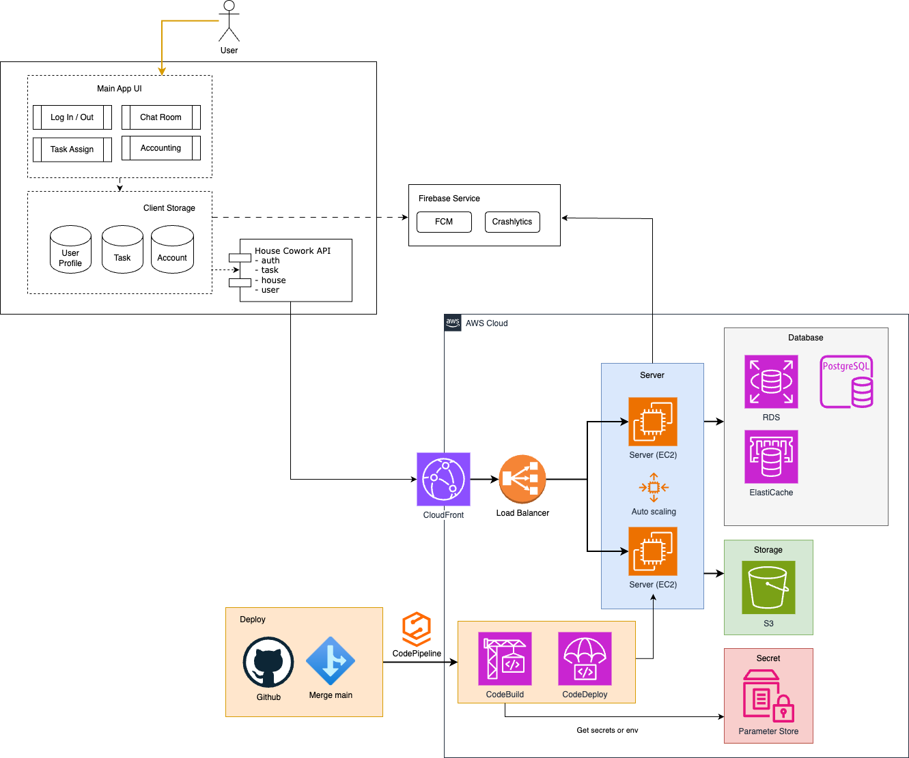

# House Cowork


House Cowork is a collaborative platform designed to manage and coordinate shared living spaces. It provides features for managing house members, tasks, invitations, and join requests.

## Project Architecture Overview



### Other Architecture Decision Records (ADR) & Design Diagrams

We use ADR to record the architectural decisions for this project. You can find them here: [house-cowork-ADR](https://github.com/Joazen544/house-cowork-architecture/tree/main/docs/ADRs) and more design diagrams here: [house-cowork-architecture](https://github.com/Joazen544/house-cowork-architecture/tree/main/docs/diagrams).

## Skills & Technologies

### Backend Frameworks

- NestJS

### Database

- PostgreSQL

### Cloud Services

- AWS
  - EC2
  - ECS
  - S3
  - CloudFront
  - RDS
  - Parameter Store
  - Elasticache

### Containerization

- Docker (server deployment)

### Programming Languages

- TypeScript

### Deployment Strategies

- Blue/Green Deployment

### CI/CD

- GitHub Actions

### Mobile & Web Services

- Firebase

### API Documentation

- Swagger

## Features

- **House Management**: Create and manage houses, including setting rules and descriptions.
- **Member Management**: Add and manage house members.
- **Task Management**: Create, assign, and track tasks within a house.

## Getting Started

### Prerequisites

- Node.js (version 20 or higher)
- npm (Node Package Manager)
- PostgreSQL database

### Installation

1. Clone the repository:

   ```bash
   git clone https://github.com/yourusername/house_cowork.git
   cd house_cowork
   ```

2. Install dependencies:

   ```bash
   npm install
   ```

3. Set up your environment variables. Create a `.env.development` or `.env.production` file in the root directory and add the following:

   ```plaintext
   DATABASE_TYPE=postgres
   DATABASE_NAME=your_database_name
   DATABASE_HOST=your_database_host
   DATABASE_PORT=5432
   DATABASE_USERNAME=your_database_username
   DATABASE_PASSWORD=your_database_password
   JWT_SECRET=your_jwt_secret
   ```

4. Run database migrations:

   ```bash
   npm run migration:run
   ```

### Running the Application

- **Development Mode**:

  ```bash
  npm run start:dev
  ```

- **Production Mode**:

  ```bash
  npm run build
  npm run start:prod
  ```

## API Documentation

The API is documented using Swagger. Once the application is running, you can access the documentation at `http://localhost:3000/api`.

## Deployment

The project includes a GitHub Actions workflow for deploying to an EC2 instance. Ensure you have the necessary secrets set up in your GitHub repository:

- `EC2_SSH_PRIVATE_KEY`
- `EC2_SERVER_IP`
- `EC2_USERNAME`

## Contributing

Contributions are welcome! Please fork the repository and submit a pull request.

## Contact

For any inquiries, please contact johnsons544@gmail.com.

## Acknowledgments

Thank you to [@pollyannaanalytics](https://github.com/pollyannaanalytics), the best Android developer, for helping me build the mobile app for this project. Our friend Chloe Yang, for helping us become the best PM and designer.

We're still working on the first version of this project, which will soon be available on the Google Play Store.
